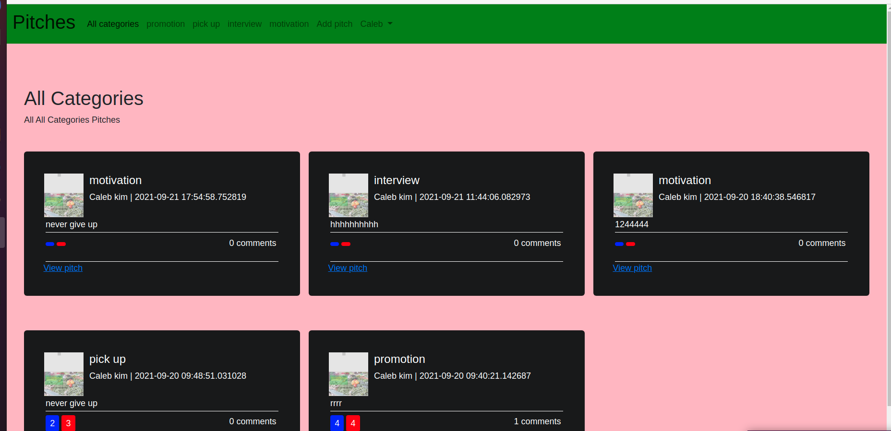

## NEWSAPI 
## BY
**CALEB KIMUTAI KIPNGETICH**

## Description

 
## How it works 
As a user can ;
* User will click register button to create account.
* user can login to his account and see his profile.
 
* See the comment and the time a pitch was created.

* Able to logout from his account

## Behavior driven devlopment (BDD)

| ACTION        | OUTPUT              | Behaviour                                         |
| ---------------- |:--------------------:| -------------------------------------------------:|
| click add pitch button          |select pitch category  | User is able to post a pitch |
| click send button    |sends the comment for the pitch  |  comment is appended below the comment section                 |

## Installation

Installation for the package can be done via `pip`:  
.pip install flask-bootstrap  
.pip install flask-uploads  
.pip install flask-wtf etc.

## Link to website
. 
## screenshot

## Setup
* git clone 

* Install pip which is the flask package manager.
* Isntall flask-migrate to help us initialize our database migrations.
* run "pip install flask to install flask.
* run "atom ." or "code ." in you terminal depending on the text editor you wish to use.

## Known Bugs
No known bugs.

## Technologies Used
* Python
*Bootsrtrap
* Flask framework that is a Python microframework.
* Javascript

## Support and contact details
For feedback and any contribution contact me through;
* Email: calebkimutai97@gmail.com
* Phone no: O707160385

### License
[MITlicense](LICENSE) 2021 **CALEB KIMUTAI KIPNGETICH**